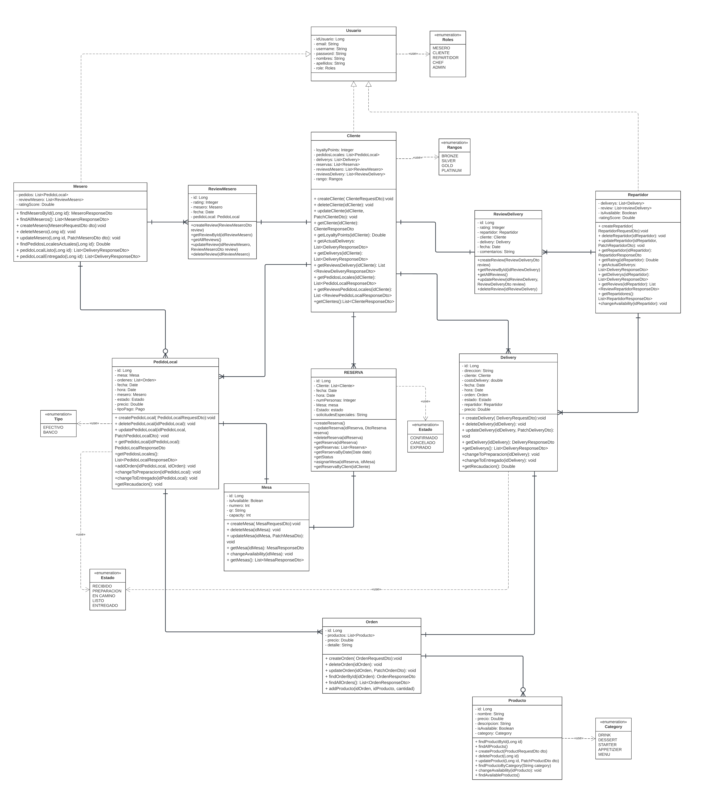

# Sistema Digital de Gestión de Pedidos y Evaluación de Servicio para Restaurantes con QR

## CS 2031 Desarrollo Basado en Plataforma

**Integrantes:**
- Aguinaga Pizarro, Piero Alessandro
- Muñoz Paucar, Fernando Jose
- Tabraj Morales, Sebastián
- Tinco Aliaga, César Abelardo

## Índice
- [Introducción](#introducción)
- [Identificación del Problema o Necesidad](#identificación-del-problema-o-necesidad)
- [Descripción de la Solución](#descripción-de-la-solución)
- [Modelo de Entidades](#modelo-de-entidades)
- [Testing y Manejo de Errores](#testing-y-manejo-de-errores)
- [Medidas de Seguridad Implementadas](#medidas-de-seguridad-implementadas)
- [Eventos y Asincronía](#eventos-y-asincronía)
- [GitHub](#github)
- [Conclusión](#conclusión)
- [Apéndices](#apéndices)

## Introducción

### Contexto
La experiencia en restaurantes está evolucionando con la digitalización de los procesos. Este proyecto responde a la necesidad de mejorar la eficiencia en la toma de pedidos y la interacción entre los clientes y los meseros. Aunque el mesero sigue desempeñando un papel crucial, desde recibir a los clientes hasta entregar los pedidos y resolver dudas, el sistema busca facilitar el acceso al menú y optimizar el proceso de pedidos. Además, se incluye un método automatizado de evaluación del servicio mediante códigos QR, lo que permite a los administradores obtener retroalimentación precisa para mejorar la atención al cliente y premiar el buen desempeño de los meseros.

### Objetivos del Proyecto
- Facilitar a los clientes la visualización del menú y la realización de pedidos mediante el escaneo de un código QR en la mesa, sin reemplazar el rol del mesero, quien continuará recepcionando a los clientes, entregando los pedidos y atendiéndolos en sus necesidades adicionales.
- Proporcionar una vía para que los clientes califiquen el servicio de los meseros al finalizar su consumo, mediante un segundo código QR que estará en la boleta, permitiendo a los administradores obtener comentarios y calificaciones de manera rápida y efectiva.
- Otorgar al administrador herramientas para la gestión del desempeño de los meseros, basadas en los comentarios y calificaciones de los clientes, para incentivar buenas prácticas mediante bonificaciones o menciones especiales.

## Identificación del Problema o Necesidad

### Descripción del Problema
El sistema busca resolver la necesidad de eficiencia y precisión en la toma de pedidos, a la vez que mantiene el contacto personal entre el mesero y el cliente. La intervención del mesero sigue siendo clave, ya que es quien recibe a los clientes, ofrece la atención durante su estancia y entrega los pedidos. Al mismo tiempo, la implementación de un sistema de evaluación mediante códigos QR permite al administrador recopilar comentarios precisos sobre el desempeño de cada mesero, incentivando la mejora continua y asegurando una experiencia de calidad para los clientes.

### Justificación
Es relevante solucionar este problema porque permite agilizar el proceso de pedidos, reduciendo errores y tiempos de espera, lo que incrementa la satisfacción del cliente. Además, el sistema de evaluación fomenta una cultura de mejora continua en los empleados, lo que beneficia tanto al restaurante como a los meseros.

## Descripción de la Solución

### Actores del Negocio
1. **Manager**: Encargo de gestión de personal, atención al cliente, gestión de inventarios y manejo de caja. 
2. **Mesero**: Encargado de la atención personal al cliente en el local. 
3. **Repartidor**: Encargado de la entrega de pedidos por delivery. 
4. **Cliente registrado**: Cliente con una cuenta creada en la aplicación del restaurante. 
5. **Cliente general**: Cliente de "al paso" que no está registrado en la aplicación del restaurante. 
6. **Chef**: Recibe órdenes y las prepara.   

### Entidades del Negocio
1. **User**
2. **Client**
3. **Repartidor**
4. **Mesero**
5. **Mesa** 
6. **Orden**
7. **Reservation**
8. **Delivery**
9. **PedidoLocal**
10. **Product**
11. **ReviewMesero**
12. **ReviewDelivery**

### Casos de uso del Negocio
1. **QR en la mesa para acceso al menú y pedidos**: Los clientes pueden escanear un código QR para acceder al menú y realizar pedidos de forma digital.
2. **Carrito de compras virtual**: Los clientes pueden agregar productos al carrito, modificarlos y personalizar sus pedidos.
3. **QR personalizado para meseros**: Un código QR específico para cada mesero se incluye en la boleta, lo que permite una evaluación rápida y directa.
4. **Sistema de evaluación del servicio**: Los clientes pueden calificar el servicio del mesero mediante un sistema de evaluación con estrellas.
5. **Panel de control para el administrador**: El administrador puede gestionar las evaluaciones y calificaciones de los meseros.

### Tecnologías Utilizadas
- **Lenguajes de programación**: Java
- **Frameworks**: Express.js para la creación de API, Bootstrap para el frontend.
- **Bases de datos**: PostgreSQL para almacenamiento de datos.
- **API externas**: Google Maps API para la localización de clientes en pedidos a domicilio.

## Modelo de Entidades

### Diagrama de Entidades

### Descripción de Entidades

#### 1. User (Abstracta)
Clase padre para los usuarios del sistema, a su vez implementa la clase UserDetails.

**Atributos**:

| **Atributo**  | **Tipo de Variable** | **Descripción**                                   | **Criterios Limitantes**                                     |
|---------------|----------------------|---------------------------------------------------|--------------------------------------------------------------|
| `id`          | `Long`               | Identificador único del usuario.                  | Debe ser único, generado automáticamente.                    |
| `name`        | `String`             | Nombre del usuario.                               | Máximo 100 caracteres. No puede estar vacío.                 |
| `email`       | `String`             | Correo electrónico del usuario.                   | Formato válido de correo. Debe ser único.                    |
| `password`    | `String`             | Contraseña para la autenticación del usuario.     | Mínimo 8 caracteres. Debe estar encriptada.                  |
| `role`        | `Enum`               | Rol del usuario dentro del sistema.               | Valores permitidos: `ADMIN`, `REPARTIDOR`, `MESERO`, `CHEF`. |

---

#### 2. Client (Hereda de User)
Representa a los clientes registrados del restaurante.

| **Atributo**        | **Tipo de Variable**   | **Descripción**                                               | **Criterios Limitantes**                                               |
|---------------------|------------------------|---------------------------------------------------------------|------------------------------------------------------------------------|
| `loyaltyPoints`     | `Integer`              | Puntos de lealtad acumulados por el cliente.                  | No negativo. Puede tener límites de acuerdo con el sistema de lealtad. |
| `pedidosLocales`    | `List<PedidoLocal>`    | Lista de pedidos realizados en el restaurante por el cliente. | Puede ser una lista vacía.                                             |
| `deliverys`         | `List<Delivery>`       | Lista de pedidos de delivery realizados por el cliente.       | Puede ser una lista vacía.                                             |
| `reservas`          | `List<Reserva>`        | Lista de reservas realizadas por el cliente.                  | Puede ser una lista vacía.                                             |
| `reviewsMesero`     | `List<ReviewMesero>`   | Lista de reviews realizadas por el cliente a meseros.         | Puede ser una lista vacía.                                             |
| `reviewDelivery`    | `List<ReviewDelivery>` | Lista de reviews realizadas por el cliente a repartidores.    | Puede ser una lista vacía.                                             |
| `rango`             | `Enum`                 | Rango basado en puntos de lealtad del cliente.                | Valores permitidos: `BRONCE`, `SILVER`, `GOLD`, `PLATINUM`.            |

**Métodos del endpoint `/cliente`**:

| **Método**           | **Ruta**          | **Roles Permitidos** | **Descripción**                                                          | **Excepciones**                                         | **Métodos de Service**                            | 
|----------------------|-------------------|----------------------|--------------------------------------------------------------------------|---------------------------------------------------------|---------------------------------------------------|
| `GET`                | `/{id}`           | `ADMIN`              | Devuelve el `ClienteResponseDto` del cliente por su id.                  | `UsernameNotFoundException`                             | `findClienteById(Long id)`                        |
| `GET`                | `/`               | `ADMIN`              | Devuelve el `ClienteResponseDto` de todos los clientes.                  | -                                                       | `findAllClientes()`                               |
| `POST`               | `/`               | -                    | Crea un nuevo cliente con `ClienteRequestDto`.                           | `IllegalArgumentException`                              | `createCliente(ClienteRequestDto dto)`            |
| `DELETE`             | `/{id}`           | `ADMIN`              | Elimina un cliente por su id.                                            | `UsernameNotFoundException`                             | `deleteCliente(Long id)`                          |
| `PATCH`              | `/{id}`           | `ADMIN`              | Actualiza un cliente por su id con `PatchClienteDto`.                    | `UsernameNotFoundException`, `IllegalArgumentException` | `updateCliente(Long id, PatchClienteDto dto)`     |
| `GET`                | `/me`             | `CLIENTE`            | Devuelve el `ClienteResponseDto` del usuario autenticado.                | `UsernameNotFoundException`                             | `getAuthenticatedCliente()`                       |
| `DELETE`             | `/me`             | `CLIENTE`            | Elimina el cliente autenticado.                                          | `UsernameNotFoundException`                             | `deleteAuthenticatedCliente()`                    |
| `PATCH`              | `/me`             | `CLIENTE`            | Actualiza el cliente autenticado con `PatchClienteDto`.                  | `UsernameNotFoundException`, `IllegalArgumentException` | `updateAuthenticatedCliente(PatchClienteDto dto)` |
| `GET`                | `/me/pedidoLocal` | `CLIENTE`            | Devuelve el `PedidoResponseDto` del pedido local en proceso del usuario. | `UsernameNotFoundException`                             | `getActualPedidoLocal()`                          |
| `GET`                | `/me/delivery`    | `CLIENTE`            | Devuelve el `PedidoResponseDto` del delivery en proceso del usuario.     | `UsernameNotFoundException`                             | `getActualDelivery()`                             | 
| `GET`                | `/me/reserva`     | `CLIENTE`            | Devuelve el `PedidoResponseDto` de la reserva en proceso del usuario.    | `UsernameNotFoundException`                             | `getActualtReserva()`                             |

**Métodos adicionales del service:**

| **Método**            | **Descripción**                                                                        | 
|-----------------------|----------------------------------------------------------------------------------------|
| `updateLoyaltyPoints` | Agrega `loyalty points` y en caso cumpla las condiciones, cambia el rango del cliente. |

---

#### 3. Mesero (Hereda de User)
Representa a los meseros que atienden el restaurante

**Atributos**:

| **Atributo**        | **Tipo de Variable**     | **Descripción**                                                 | **Criterios Limitantes**                                      |
|---------------------|--------------------------|-----------------------------------------------------------------|---------------------------------------------------------------|
| `pedidosLocales`    | `List<PedidoLocal>`      | Lista de pedidos locales que ha gestionado el mesero.           | Puede ser una lista vacía.                                    |
| `reviewsMesero`     | `List<ReviewMesero>`     | Lista de reviews recibidas por el mesero.                       | Puede ser una lista vacía.                                    |
| `ratingScore`       | `Double`                 | Promedio de puntaje de las evaluaciones recibidas por clientes. | Rango entre 0.0 y 5.0, con dos decimales de precisión.        |

**Métodos del endpoint `/mesero`**:

| **Método**       | **Ruta**                       | **Roles Permitidos**     | **Descripción**                                                                 | **Excepciones**                                         | **Métodos de Service**                      |
|------------------|--------------------------------|--------------------------|---------------------------------------------------------------------------------|---------------------------------------------------------|---------------------------------------------|
| `GET`            | `/{id}`                        | `ADMIN`                  | Devuelve el `MeseroResponseDto` del empleado por su id.                         | `UsernameNotFoundException`                             | `findMeseroById(Long id)`                   |
| `GET`            | `/`                            | `ADMIN`                  | Devuelve el `MeseroResponseDto` de todos los empleados.                         | -                                                       | `findAllMeseros()`                          |
| `POST`           | `/`                            | `ADMIN`                  | Crea un nuevo empleado con `MeseroRequestDto`.                                  | `IllegalArgumentException`                              | `createMesero(MeseroRequestDto dto)`        |
| `DELETE`         | `/{id}`                        | `ADMIN`                  | Elimina un empleado por su id.                                                  | `UsernameNotFoundException`                             | `deleteMesero(Long id)`                     |
| `PATCH`          | `/{id}`                        | `ADMIN`                  | Actualiza un empleado por su id con `PatchMeseroDto`.                           | `UsernameNotFoundException`, `IllegalArgumentException` | `updateMesero(Long id, PatchMeseroDto dto)` |
| `GET`            | `/me`                          | `MESERO`                 | Devuelve `MeseroResponseDto` del mesero autenticado.                            | `UsernameNotFoundException`                             | `findMeseroById(Long id)`                   |
| `GET`            | `/me/pedidosLocalesActuales`   | `MESERO`                 | Devuelve la lista de PedidoLocalResponseDto con el estado `LISTO` y `RECIBIDO`. | `UsernameNotFoundException`                             | `findPedidosLocalesActuales(Long id)`       |                             
| `PATCH`          | `me/{idPedidoLocal}/encamino`  | `MESERO`                 | Cambia el estado de la entrega a Listo.                                         | `ResourceNotFoundException`                             | `pedidoLocalListo(Long id)`                 |
| `PATCH`          | `me/{idPedidoLocal}/entregado` | `MESERO`                 | Cambia el estado de la entrega a Entregado .                                    | `ResourceNotFoundException`                             | `pedidoLocalEntregado(Long id)`             | 

**Métodos adicionales del service:**

| **Método**            | **Descripción**                                                                                     | 
|-----------------------|-----------------------------------------------------------------------------------------------------|
| `updateRatingScore()` | Obtiene el promedio de los ratings de la review del mesero y actualiza el campo.                    |
| `asignarMesero()`     | Verifica la cantidad de Pedidos Locales que tiene cada mesero y asigna al que tenga menor cantidad. |

**Anotaciones**
- Cada vez que se asigna un pedido a un `Mesero`, se manda un correo al mesero asignado. 
- Si el `ratingScore` del `Mesero` es bajo o alto, se manda un correo felicitando o advirtiendo al `Mesero`, también se manda un correo al administrador.  

---

#### 4. Repartidor (Hereda de User)
Representa a los Repartidores que atienden el restaurante

**Atributos**:

| **Atributo**         | **Tipo de Variable**     | **Descripción**                                                 | **Criterios Limitantes**                                      |
|----------------------|--------------------------|-----------------------------------------------------------------|---------------------------------------------------------------|
| `deliverys`          | `List<Delivery>`         | Lista de entregas (deliverys) que ha gestionado el repartidor.  | Puede ser una lista vacía.                                    |
| `reviewsRepartidor`  | `List<ReviewDelivery>`   | Lista de reviews recibidas por el repartidor.                   | Puede ser una lista vacía.                                    |
| `ratingScore`        | `Double`                 | Promedio de puntaje de las evaluaciones recibidas por clientes. | Rango entre 0.0 y 5.0, con dos decimales de precisión.        |

**Métodos del endpoint `/repartidor`**:

| **Método**           | **Ruta**                     | **Roles Permitidos** | **Descripción**                                                      | **Excepciones**                                         | **Métodos de Service**                              |
|----------------------|------------------------------|----------------------|----------------------------------------------------------------------|---------------------------------------------------------|-----------------------------------------------------|
| `GET`                | `/{id}`                      | `ADMIN`              | Devuelve el `RepartidorResponseDto` del repartidor por su id.        | `UsernameNotFoundException`                             | `findRepartidorById(Long id)`                       |
| `GET`                | `/`                          | `ADMIN`              | Devuelve el `RepartidorResponseDto` de todos los repartidores.       | -                                                       | `findAllRepartidors()`                              |
| `POST`               | `/`                          | `ADMIN`              | Crea un nuevo repartidor con `RepartidorRequestDto`.                 | `IllegalArgumentException`                              | `createRepartidor(RepartidorRequestDto dto)`        |
| `DELETE`             | `/{id}`                      | `ADMIN`              | Elimina un repartidor por su id.                                     | `UsernameNotFoundException`                             | `deleteRepartidor(Long id)`                         |
| `PATCH`              | `/{id}`                      | `ADMIN`              | Actualiza un repartidor por su id con `PatchRepartidorDto`.          | `UsernameNotFoundException`, `IllegalArgumentException` | `updateRepartidor(Long id, PatchRepartidorDto dto)` |                            
| `GET`                | `/me`                        | `REPARTIDOR`         | Devuelve DeliveryResponseDto del mesero autenticado.                 | `UsernameNotFoundException`                             | `findRepartidorById(Long id)`                       |
| `GET`                | `/me/deliverysActuales`      | `REPARTIDOR`         | Devuelve la lista de DeliveryResponseDto con el estado "LISTO".      | `UsernameNotFoundException`                             | `findDeliverysActuales(Long id)`                    |
| `PATCH`              | `/me/{idDelivery}/encamino`  | `REPARTIDOR`         | Cambia el estado de la entrega a En camino.                          | `ResourceNotFoundException`                             | `endDelivery(Long id)`                              |
| `PATCH`              | `/me/{idDelivery}/entregado` | `REPARTIDOR`         | Cambia el estado de la entrega a Entregado .                         | `ResourceNotFoundException`                             | `endDelivery(Long id)`                              |

**Métodos adicionales del service:**

| **Método**            | **Descripción**                                                                                   | 
|-----------------------|---------------------------------------------------------------------------------------------------|
| `updateRatingScore()` | Obtiene el promedio de los ratings de la review del repartidor y actualiza el campo.              |
| `asignarRepartidor()` | Verifica la cantidad de deliverys que tiene cada repartidor y asigna al que tenga menor cantidad. |

**Anotaciones**

- Cada vez que se asigna un pedido a un `Repartidor`, se manda un correo al `Repartidor` asignado.
- Si el `ratingScore` del `Repartidor` es bajo o alto, se manda un correo felicitando o advirtiendo al `Repartidor`, también se manda un correo al administrador.  

---

#### 5. Mesa
Representa las mesas del restaurante.

**Atributos**:

| **Atributo**  | **Tipo de Variable** | **Descripción**                                                         | **Criterios Limitantes**                       |
|---------------|----------------------|-------------------------------------------------------------------------|------------------------------------------------|
| `id`          | `Long`               | Identificador único de la mesa.                                         | Debe ser único y generado automáticamente.     |
| `qr`          | `String`             | Código QR asociado a la mesa para acceder al menú.                      | Longitud máxima de 255 caracteres.             |
| `numero`      | `Integer`            | Número de la mesa en el restaurante.                                    | Debe ser único en el contexto del restaurante. |
| `capacity`    | `Integer`            | Capacidad máxima de personas que pueden sentarse en la mesa.            | Valor mayor a 0.                               |
| `isAvailable` | `Boolean`            | Indica si la mesa está disponible (true = disponible, false = ocupada). | No tiene limitantes, es un valor booleano.     |

**Métodos del endpoint `/mesa`**:

| **Método**  | **Ruta**           | **Roles Permitidos** | **Descripción**                                                                                      | **Excepciones**                                         | **Métodos de Service**                    |
|-------------|--------------------|----------------------|------------------------------------------------------------------------------------------------------|---------------------------------------------------------|-------------------------------------------|
| `GET`       | `/{id}`            | `ADMIN`              | Devuelve el `TableResponseDto` de la mesa por su id.                                                 | `ResourceNotFoundException`                             | `findTableById(Long id)`                  |
| `GET`       | `/`                | `ADMIN`              | Devuelve el `TableResponseDto` de todas las mesas.                                                   | -                                                       | `findAllTables()`                         |
| `POST`      | `/`                | `ADMIN`              | Crea una nueva mesa con `TableRequestDto`.                                                           | `IllegalArgumentException`                              | `createTable(TableRequestDto dto)`        |
| `DELETE`    | `/{id}`            | `ADMIN`              | Elimina una mesa por su id.                                                                          | `ResourceNotFoundException`                             | `deleteTable(Long id)`                    |
| `PATCH`     | `/{id}`            | `ADMIN`              | Actualiza una mesa por su id con `PatchTableDto`.                                                    | `ResourceNotFoundException`, `IllegalArgumentException` | `updateTable(Long id, PatchTableDto dto)` |
| `GET`       | `/availableTables` | `MESERO`             | Devuelve el número de mesa de todas las mesas disponibles(ni reservadas ni ocupadas) en ese momento. | -                                                       | `getAvailableTables()`                    |      | `GET`       | `/QR/{id}`         | `ADMIN`              | Devuelve el `TableResponseDto` de la mesa por su id.                                                 | `ResourceNotFoundException`                             | `findByAvailableTrur(Long id)`            |      | `GET`       | `/capacity`         | `ADMIN`              | Devuelve el `TableResponseDto` de las mesas con capacidad x                                                 | ``                             | `getMesasByCapacity(Long id)`                  |                 
           

**Métodos adicionales del service:**

| **Método**          | **Descripción**                      | 
|---------------------|--------------------------------------|
| `changeStatus()`    | Conmuta la disponibilidad de la mesa |

**Anotaciones**
- Cada vez que se cree una mesa, se envia un correo con la imagen del QR, igualmente con el endpoint /mesa/QR/{id}
- El qr  envía al link de crear pedidoLocal con la id de la mesa

---

#### 6. Orden
Representa los pedidos realizados por los clientes.

**Atributos**:

| **Atributo** | **Tipo de Variable** | **Descripción**                                                        | **Criterios Limitantes**                                          |
|--------------|----------------------|------------------------------------------------------------------------|-------------------------------------------------------------------|
| `id`         | `Long`               | Identificador único del pedido.                                        | Debe ser único y generado automáticamente.                        |
| `precio`     | `Double`             | Precio total del pedido.                                               | Debe ser un valor mayor o igual a 0.0.                            |
| `productos`  | `List<Producto>`     | Lista de productos individuales incluidos en el pedido.                | Puede ser una lista vacía, pero no debe contener elementos nulos. |
| `detalle`    | `String`             | Instrucciones especiales para el pedido (ej: sin gluten, extra salsa). | Longitud máxima de 500 caracteres.                                |

**Métodos del endpoint `/order`**:

| **Método** | **Ruta**                             | **Roles Permitidos** | **Descripción**                                       | **Excepciones**                                         | **Métodos de Service**                            |
|------------|--------------------------------------|----------------------|-------------------------------------------------------|---------------------------------------------------------|---------------------------------------------------|
| `GET`      | `/{id}`                              | `CLIENTE`            | Devuelve el `OrderResponseDto` de la orden por su id. | `ResourceNotFoundException`                             | `findOrderById(Long id)`                          |
| `GET`      | `/`                                  | `ADMIN`              | Devuelve el `OrderResponseDto` de todas las órdenes.  | -                                                       | `findAllOrders()`                                 |
| `POST`     | `/`                                  | `ADMIN`              | Crea una nueva orden con `OrderRequestDto`.           | `IllegalArgumentException`                              | `createOrder(OrderRequestDto dto)`                |
| `DELETE`   | `/{id}`                              | `ADMIN`              | Elimina una orden por su id.                          | `ResourceNotFoundException`                             | `deleteOrder(Long id)`                            |
| `PATCH`    | `/{id}`                              | `ADMIN`              | Actualiza una orden por su id con `PatchOrderDto`.    | `ResourceNotFoundException`, `IllegalArgumentException` | `updateOrder(Long id, PatchOrderDto dto)`         |
| `PATCH`    | `/{idOrden}/{idProducto}/{cantidad}` | `CLIENTE`, `MESERO`  | Agrega un producto a la orden.                        | `ResourceNotFoundException`, `IllegalArgumentException` | `addProducto(Long id, Long idProducto, cantidad)` |

---

#### 7. Delivery
Representa los pedidos que son entregados a domicilio.

**Atributos**:

| **Atributo**    | **Tipo de Variable** | **Descripción**                                                         | **Criterios Limitantes**                                                           |
|-----------------|----------------------|-------------------------------------------------------------------------|------------------------------------------------------------------------------------|
| `id`            | `Long`               | Identificador único de la entrega.                                      | Debe ser único y generado automáticamente.                                         |
| `cliente`       | `Cliente`            | Cliente que solicitó el pedido (relación con la entidad `Cliente`).     | No puede ser nulo; debe existir un cliente asociado.                               |
| `direccion`     | `String`             | Dirección donde se entregará el pedido.                                 | Longitud máxima de 255 caracteres; no puede estar vacía.                           |
| `costoDelivery` | `Double`             | Costo del servicio de entrega.                                          | Debe ser un valor mayor o igual a 0.0.                                             |
| `fecha`         | `LocalDate`          | Fecha de creación de la entrega.                                        | No puede ser nula; debe representar una fecha válida.                              |
| `hora`          | `LocalTime`          | Hora de creación de la entrega.                                         | No puede ser nula; debe representar una hora válida.                               |
| `estado`        | `enum`               | Estado del pedido (`RECIBIDO`, `EN_PREPARACION`, `ENTREGADO`).          | Debe ser uno de los valores permitidos: `RECIBIDO`, `EN_PREPARACION`, `ENTREGADO`. |
| `order`         | `Order`              | Pedido relacionado con la entrega (relación con la entidad `Order`).    | No puede ser nulo; debe existir un pedido asociado.                                |
| `repartidor`    | `Repartidor`         | Empleado que realiza la entrega (relación con la entidad `Repartidor`). | No puede ser nulo; debe existir un repartidor asociado.                            |
| `precio`        | `Double`             | Precio total del pedido entregado.                                      | Debe ser un valor mayor o igual a 0.0.                                             |

**Métodos del endpoint `/delivery`**:

| **Método**  | **Ruta**                    | **Roles Permitidos**    | **Descripción**                                                                       | **Excepciones**                                         | **Métodos de Service**                          | **Eventos**                     |
|-------------|-----------------------------|-------------------------|---------------------------------------------------------------------------------------|---------------------------------------------------------|-------------------------------------------------|---------------------------------|
| `GET`       | `/{id}`                     | `ADMIN`                 | Devuelve el `DeliveryResponseDto` de la entrega por su id.                            | `ResourceNotFoundException`                             | `findDeliveryById(Long id)`                     | -                               |
| `GET`       | `/`                         | `ADMIN`                 | Devuelve el `DeliveryResponseDto` de todas las entregas.                              | -                                                       | `findAllDeliveries()`                           | -                               |
| `POST`      | `/`                         | `CLIENTE`               | Crea una nueva entrega con `DeliveryRequestDto`.                                      | `IllegalArgumentException`                              | `createDelivery(DeliveryRequestDto dto)`        | `DeliveryCreadaEvent`           |
| `DELETE`    | `/{id}`                     | `CLIENTE`, `REPARTIDOR` | Elimina una entrega por su id.                                                        | `ResourceNotFoundException`                             | `deleteDelivery(Long id)`                       | `DeliveryEliminadaEvent`        |
| `PATCH`     | `/{id}`                     | `ADMIN`                 | Actualiza una entrega por su id con `PatchDeliveryDto`.                               | `ResourceNotFoundException`, `IllegalArgumentException` | `updateDelivery(Long id, PatchDeliveryDto dto)` | `DeliveryActualizadaEvent`      |
| `PATCH`     | `/cocinando/{id}`           | `CHEF`                  | Cambia el estado de la entrega en preparación.                                        | `ResourceNotFoundException`                             | `endDelivery(Long id)`                          | `EstadoDeliveryPreparandoEvent` |
| `PATCH`     | `/listo/{id}`               | `CHEF`                  | Cambia el estado de la entrega a listo.                                               | `ResourceNotFoundException`                             | `endDelivery(Long id)`                          | `EstadoDeliveryListoEvent`      |
| `GET`       | `/deliverysRecibidos`       | `CHEF`                  | Devuelve el `DeliveryResponseDto` de todos los delivery's recibidos en la aplicación. | -                                                       | `findDeliverysRecibidos()`                      | -                               |

---

#### 8. PedidoLocal
Representa los pedidos realizados en el local

**Atributos**:

| **Atributo**  | **Tipo de Variable** | **Descripción**                                                        | **Criterios Limitantes**                                                           |
|---------------|----------------------|------------------------------------------------------------------------|------------------------------------------------------------------------------------|
| `id`          | `Long`               | Identificador único de la entrega de mesa.                             | Debe ser único y generado automáticamente.                                         |
| `ordenes`     | `List<Order>`        | Lista de órdenes pedidas por la mesa.                                  | No puede ser nula; debe contener al menos una orden.                               |
| `mesero`      | `Mesero`             | Empleado que realiza la entrega (relación con la entidad `Mesero`).    | No puede ser nulo; debe existir un mesero asociado.                                |
| `fecha`       | `LocalDate`          | Fecha de creación de la entrega.                                       | No puede ser nula; debe representar una fecha válida.                              |
| `hora`        | `LocalTime`          | Hora de creación de la entrega.                                        | No puede ser nula; debe representar una hora válida.                               |
| `estado`      | `String`             | Estado del pedido (`RECIBIDO`, `EN_PREPARACION`, `ENTREGADO`).         | Debe ser uno de los valores permitidos: `RECIBIDO`, `EN_PREPARACION`, `ENTREGADO`. |
| `orden`       | `Order`              | Pedido relacionado con la entrega (relación con la entidad `Order`).   | No puede ser nulo; debe existir un pedido asociado.                                |
| `precio`      | `Double`             | Precio total de la entrega.                                            | Debe ser un valor mayor o igual a 0.0.                                             |
| `tipoPago`    | `String`             | Método de pago utilizado (efectivo o QR).                              | Debe ser uno de los valores permitidos: EFECTIVO, QR.                              |

**Métodos del endpoint `/pedidolocal`**:

| **Método**  | **Ruta**                     | **Roles Permitidos**  | **Descripción**                                                                               | **Excepciones**                                         | **Métodos de Service**                                | **Eventos**                        |
|-------------|------------------------------|-----------------------|-----------------------------------------------------------------------------------------------|---------------------------------------------------------|-------------------------------------------------------|------------------------------------|
| `GET`       | `/{id}`                      | `ADMIN`               | Devuelve el `PedidoLocalResponseDto` del pedido local por su id.                              | `ResourceNotFoundException`                             | `findPedidoLocalById(Long id)`                        | -                                  |
| `GET`       | `/`                          | `ADMIN`               | Devuelve el `PedidoLocalResponseDto` de todos los pedidos locales.                            | -                                                       | `findAllPedidoLocals()`                               | -                                  |
| `POST`      | `/`                          | `ADMIN`               | Crea un nuevo pedido local con `PedidoLocalRequestDto`.                                       | `IllegalArgumentException`                              | `createPedidoLocal(PedidoLocalRequestDto dto)`        | `PedidoLocalCreadoEvent`           |
| `DELETE`    | `/{id}`                      | `ADMIN`               | Elimina un pedido local por su id.                                                            | `ResourceNotFoundException`                             | `deletePedidoLocal(Long id)`                          | `PedidoLocalEliminadoEvent`        |
| `PATCH`     | `/{id}`                      | `ADMIN`               | Actualiza un pedido local por su id con `PatchPedidoLocalDto`.                                | `ResourceNotFoundException`, `IllegalArgumentException` | `updatePedidoLocal(Long id, PatchPedidoLocalDto dto)` | `PedidoLocalActualizadoEvent`      |
| `PATCH`     | `/cocinando/{id}`            | `CHEF`                | Cambia el estado de la entrega en preparación.                                                | `ResourceNotFoundException`                             | `cocinandoPedidoLocal(Long id)`                       | `EstadoPedidoLocalPreparandoEvent` |
| `PATCH`     | `/listo/{id}`                | `CHEF`                | Cambia el estado de la entrega a listo.                                                       | `ResourceNotFoundException`                             | `listoPedidoLocal(Long id)`                           | `EstadoPedidoLocalListoEvent`      |
| `GET`       | `/pedidosLocalesRecibidos`   | `CHEF`                | Devuelve el `PedidoLocalResponseDto` de todos los pedidos locales recibidos en la aplicación. | -                                                       | `findPedidosLocalesRecibidos()`                       | -                                  |

---

#### 9. Reservation
Representa las reservas realizadas por los clientes.

**Atributos**:

| **Atributo**      | **Tipo de Variable** | **Descripción**                                                    | **Criterios Limitantes**                                                        |
|-------------------|----------------------|--------------------------------------------------------------------|---------------------------------------------------------------------------------|
| `id`              | `Long`               | Identificador único de la reserva.                                 | Debe ser único y generado automáticamente.                                      |
| `client`          | `Client`             | Cliente que realizó la reserva (relación con la entidad `Client`). | No puede ser nulo; debe existir un cliente asociado.                            |
| `reservationDate` | `LocalDate`          | Fecha en la que se realizará la reserva.                           | No puede ser nula; debe representar una fecha futura válida.                    |
| `reservationTime` | `LocalTime`          | Hora específica de la reserva.                                     | No puede ser nula; debe representar una hora válida.                            |
| `numOfPeople`     | `Integer`            | Número de personas para la reserva.                                | Debe ser mayor que 0.                                                           |
| `tableNumber`     | `Integer`            | Número de la mesa asignada para la reserva.                        | Debe ser un valor positivo; debe estar disponible.                              |
| `status`          | `String`             | Estado de la reserva (ej: pendiente, confirmada, cancelada).       | Debe ser uno de los valores permitidos: `PENDIENTE`, `CONFIRMADA`, `CANCELADA`. |
| `specialRequests` | `String`             | Solicitudes especiales del cliente para la reserva.                | Puede ser nulo; si se proporciona, no debe exceder 255 caracteres.              |

**Métodos del endpoint `/reservation`**:

| **Método**  | **Ruta**             | **Roles Permitidos**  | **Descripción**                                                    | **Excepciones**                                         | **Métodos de Service**                                | **Eventos**                   |
|-------------|----------------------|-----------------------|--------------------------------------------------------------------|---------------------------------------------------------|-------------------------------------------------------|-------------------------------|
| `GET`       | `/{id}`              | `ADMIN`               | Devuelve el `ReservationResponseDto` de la reservación por su id.  | `ResourceNotFoundException`                             | `findReservationById(Long id)`                        | -                             |
| `GET`       | `/`                  | `ADMIN`               | Devuelve el `ReservationResponseDto` de todas las reservaciones.   | -                                                       | `findAllReservations()`                               | -                             |
| `POST`      | `/`                  | `ADMIN`               | Crea una nueva reservación con `ReservationRequestDto`.            | `IllegalArgumentException`                              | `createReservation(ReservationRequestDto dto)`        | `ReservationCreadaEvent`      |
| `DELETE`    | `/{id}`              | `ADMIN`               | Elimina una reservación por su id.                                 | `ResourceNotFoundException`                             | `deleteReservation(Long id)`                          | `ReservationEliminadaEvent`   |
| `PATCH`     | `/{id}`              | `ADMIN`               | Actualiza una reservación por su id con `PatchReservationDto`.     | `ResourceNotFoundException`, `IllegalArgumentException` | `updateReservation(Long id, PatchReservationDto dto)` | `ReservationActualizadaEvent` |
| `PATCH`     | `/changestatus/{id}` | `MESERO`              | Finaliza la reservación.                                           | `ResourceNotFoundException`                             | `endReservation(Long id)`                             | -                             |

---

#### 10. Product
Representa los productos (platos o bebidas) del menú.

**Atributos**:

| **Atributo**   | **Tipo de Variable** | **Descripción**                                            | **Criterios Limitantes**                                                                                        |
|----------------|----------------------|------------------------------------------------------------|-----------------------------------------------------------------------------------------------------------------|
| `id`           | `Long`               | Identificador único del producto.                          | Debe ser único y generado automáticamente.                                                                      |
| `nombre`       | `String`             | Nombre del producto.                                       | No puede ser nulo; debe tener un tamaño mínimo de 1 carácter y un máximo de 100 caracteres.                     |
| `descripcion`  | `String`             | Descripción del producto.                                  | Puede ser nulo; si se proporciona, no debe exceder 255 caracteres.                                              |
| `precio`       | `BigDecimal`         | Precio del producto.                                       | Debe ser un valor positivo; no puede ser nulo.                                                                  |
| `category`     | `Enum`               | Categoría del producto (entrada, plato principal, bebida). | No puede ser nulo; debe ser uno de los valores permitidos: `DRINK`, `DESSERT`, `STARTER`, `APPETIZIER`, `MENU`. |
| `isAvailable`  | `Boolean`            | Disponibilidad del producto.                               | No puede ser nulo; indica si el producto está disponible (true) o no (false).                                   |

**Métodos del endpoint `/product`**:

| **Método** | **Ruta**                   | **Roles Permitidos** | **Descripción**                                                               | **Excepciones**                                         | **Métodos de Service**                        | **Eventos**               |
|------------|----------------------------|----------------------|-------------------------------------------------------------------------------|---------------------------------------------------------|-----------------------------------------------|---------------------------|
| `GET`      | `/{id}`                    | `ADMIN`              | Devuelve el `ProductResponseDto` del producto por su id.                      | `ResourceNotFoundException`                             | `findProductById(Long id)`                    | -                         |
| `GET`      | `/`                        | `ADMIN`              | Devuelve el `ProductResponseDto` de todos los productos.                      | -                                                       | `findAllProducts()`                           | -                         |
| `POST`     | `/`                        | `ADMIN`              | Crea un nuevo producto con `ProductRequestDto`.                               | `IllegalArgumentException`                              | `createProduct(ProductRequestDto dto)`        | `ProductCreadoEvent`      |
| `DELETE`   | `/{id}`                    | `ADMIN`              | Elimina un producto por su id.                                                | `ResourceNotFoundException`                             | `deleteProduct(Long id)`                      | `ProductEliminadoEvent`   |
| `PATCH`    | `/{id}`                    | `ADMIN`              | Actualiza un producto por su id con `PatchProductDto`.                        | `ResourceNotFoundException`, `IllegalArgumentException` | `updateProduct(Long id, PatchProductDto dto)` | `ProductActualizadoEvent` |
| `GET`      | `/category/{category}`     | `ADMIN`              | Devuelve un producto filtrado por su categoría mediante `ProductResponseDto`. | `ResourceNotFoundException`, `IllegalArgumentException` | `findProductoByCategory(String category)`     | -                         |
| `PATCH`    | `/changeAvailability/{id}` | `ADMIN`              | Actualiza la disponibilidad de un producto con `PatchProductDto`.             | `ResourceNotFoundException`, `IllegalArgumentException` | `changeAvailability(idProducto)`              | -                         |
| `GET`      | `/available`               | `ADMIN`              | Devuelve una lista de productos disponibles.                                  | `ResourceNotFoundException`                             | `findAvailableProducto()`                     | -                         |

---

#### 11. ReviewMesero
Representa la evaluación del servicio prestado por el mesero.

**Atributos**:

| **Atributo**  | **Tipo de Variable** | **Descripción**                                   | **Criterios Limitantes**                                        |
|---------------|----------------------|---------------------------------------------------|-----------------------------------------------------------------|
| `id`          | `Long`               | Identificador único de la evaluación.             | Debe ser único y generado automáticamente.                      |
| `mesero`      | `Mesero`             | Mesero evaluado (relación con `Mesero`).          | No puede ser nulo; debe referirse a un mesero existente.        |
| `rating`      | `Integer`            | Puntuación de la evaluación (de 0 a 5 estrellas). | No puede ser nulo; debe estar en el rango de 0 a 5.             |
| `pedidoLocal` | `Order`              | Pedido asociado a la evaluación.                  | No puede ser nulo; debe referirse a un pedido existente.        |
| `date`        | `LocalDateTime`      | Fecha y hora de la evaluación.                    | No puede ser nulo; debe ser la fecha y hora actual o anterior.  |

**Métodos del endpoint `/reviewMesero`**:

| **Método** | **Ruta**    | **Roles Permitidos** | **Descripción**                                                          | **Excepciones**                                         | **Métodos de Service**                                  | **Eventos**                    |
|------------|-------------|----------------------|--------------------------------------------------------------------------|---------------------------------------------------------|---------------------------------------------------------|--------------------------------|
| `GET`      | `/{id}`     | `ADMIN`              | Devuelve el `ReviewMeseroResponseDto` de la reseña del mesero por su id. | `ResourceNotFoundException`                             | `findReviewMeseroById(Long id)`                         | -                              |
| `GET`      | `/`         | `ADMIN`              | Devuelve el `ReviewMeseroResponseDto` de todas las reseñas de meseros.   | -                                                       | `findAllReviewMeseros()`                                | -                              |
| `POST`     | `/`         | `ADMIN`              | Crea una nueva reseña de mesero con `ReviewMeseroRequestDto`.            | `IllegalArgumentException`                              | `createReviewMesero(ReviewMeseroRequestDto dto)`        | `ReviewMeseroCreadaEvent`      |
| `DELETE`   | `/{id}`     | `ADMIN`              | Elimina una reseña de mesero por su id.                                  | `ResourceNotFoundException`                             | `deleteReviewMesero(Long id)`                           | `ReviewMeseroEliminadaEvent`   |
| `PATCH`    | `/{id}`     | `ADMIN`              | Actualiza una reseña de mesero por su id con `PatchReviewMeseroDto`.     | `ResourceNotFoundException`, `IllegalArgumentException` | `updateReviewMesero(Long id, PatchReviewMeseroDto dto)` | `ReviewMeseroActualizadaEvent` |

---

#### 12. ReviewDelivery
Representa la evaluación del servicio prestado por el mesero.

**Atributos**:

| **Atributo**   | **Tipo de Variable** | **Descripción**                                             | **Criterios Limitantes**                                         |
|----------------|----------------------|-------------------------------------------------------------|------------------------------------------------------------------|
| `id`           | `Long`               | Identificador único de la evaluación.                       | Debe ser único y generado automáticamente.                       |
| `repartidor`   | `Repartidor`         | Repartidor evaluado (relación con `Repartidor`).            | No puede ser nulo; debe referirse a un repartidor existente.     |
| `client`       | `Client`             | Cliente que realiza la evaluación (relación con `Client`).  | No puede ser nulo; debe referirse a un cliente existente.        |
| `rating`       | `Integer`            | Puntuación de la evaluación (de 0 a 5 estrellas).           | No puede ser nulo; debe estar en el rango de 0 a 5.              |
| `comentarios`  | `String`             | Comentarios adicionales del cliente sobre el servicio.      | Opcional; puede ser nulo, pero debe tener un límite de longitud. |
| `delivery`     | `Delivery`           | Asociación al delivery relacionado.                         | No puede ser nulo; debe referirse a un delivery existente.       |
| `date`         | `LocalDateTime`      | Fecha y hora de la evaluación.                              | No puede ser nulo; debe ser la fecha y hora actual o anterior.   |

**Métodos del endpoint `/reviewDelivery`**:

| **Método** | **Ruta**   | **Roles Permitidos** | **Descripción**                                                                 | **Excepciones**                                         | **Métodos de Service**                                      | **Eventos**                      |
|------------|------------|----------------------|---------------------------------------------------------------------------------|---------------------------------------------------------|-------------------------------------------------------------|----------------------------------|
| `GET`      | `/{id}`    | `ADMIN`              | Devuelve el `ReviewDeliveryResponseDto` de la reseña del repartidor por su id.  | `ResourceNotFoundException`                             | `findReviewDeliveryById(Long id)`                           | -                                |
| `GET`      | `/`        | `ADMIN`              | Devuelve el `ReviewDeliveryResponseDto` de todas las reseñas de repartidores.   | -                                                       | `findAllReviewDeliverys()`                                  | -                                |
| `POST`     | `/`        | `ADMIN`              | Crea una nueva reseña de repartidor con `ReviewDeliveryRequestDto`.             | `IllegalArgumentException`                              | `createReviewDelivery(ReviewDeliveryRequestDto dto)`        | `ReviewDeliveryCreadaEvent`      |
| `DELETE`   | `/{id}`    | `ADMIN`              | Elimina una reseña de repartidor por su id.                                     | `ResourceNotFoundException`                             | `deleteReviewDelivery(Long id)`                             | `ReviewDeliveryEliminadaEvent`   |
| `PATCH`    | `/{id}`    | `ADMIN`              | Actualiza una reseña de repartidor por su id con `PatchReviewDeliveryDto`.      | `ResourceNotFoundException`, `IllegalArgumentException` | `updateReviewDelivery(Long id, PatchReviewDeliveryDto dto)` | `ReviewDeliveryActualizadaEvent` |

---

**Descripción de Exceptions:**

- `UsernameNotFoundException`: Cuando se busca por `id` o por algún otro parámetro de usuario y el recurso no existe.
- `IllegalArgumentException`: Cada que se escriba un dato mal en la búsqueda, saltará esta exception.
- `ResourceNotFoundException`: Cuando se busca por `id` o por algún otro parámetro ya sea de algún producto, delivery o entidad que no herede de User y el recurso no existe.

---

## Testing y Manejo de Errores

### Niveles de Testing Realizados

1. **Pruebas Unitarias**

 - Las pruebas unitarias se realizarán para cada endpoint de la aplicación. | Cliente termina pedidoLocal | Se evaluará la validez de la solicitud en los campos en endpoints POST y la respuesta obtenida en endpoint GET.                                    

| **Tipo de prueba**    | **Descripción**                                                                                                                                    | **Criterio de éxito**                                                                                                                         |
|-----------------------|----------------------------------------------------------------------------------------------------------------------------------------------------|-----------------------------------------------------------------------------------------------------------------------------------------------|
| Pruebas de respuesta  | Se evaluará el código de respuesta HTTP y, en caso exista, el `ResponseEntity` del endpoint.                                                       | El código de respuesta y la respuesta contiene los valores esperados.                                                                         |
| Pruebas de DTOs       | Se evaluará la validez de la solicitud en los campos en endpoints POST y la respuesta obtenida en endpoint GET.                                    | El ResponseEntity muestra los valores esperados y en caso de los POST, la aplicación no permite ingresar parámetros distintos a los posibles. |
| Manejo de excepciones | Se evaluará el código de respuesta HTTP en situaciones de errores forzados.                                                                        | Los endpoints responden con la excepción correspondiente.                                                                                     |
| Pruebas de seguridad  | Se evaluará que los usuarios autorizados puedan acceder a los endpoints y que los usuarios autenticados puedan acceder a los endpoints protegidos. | Los endpoints responden con las excepciones de seguridad correspondientes.                                                                    |

2. **Pruebas de Sistema**

- Simulación de los procesos de negocio.

| **Nombre de prueba**             | **Descripción**                                                                                                                                                                                                                                                                                                                                                                                                           |
|----------------------------------|---------------------------------------------------------------------------------------------------------------------------------------------------------------------------------------------------------------------------------------------------------------------------------------------------------------------------------------------------------------------------------------------------------------------------|
| Cliente start pedidoLocal        | Simulación de los siguientes eventos: Mesero desocupa una mesa, Cliente crea orden, se crea pedidoLocal, aparece en el menú del Chef el pedido, Chef cambia estado a `EN_PREPARACION`, Chef cambia estado a `LISTO`, Mesero recibe notificación (no se simulará), Mesero cambia el estado a `ENTREGADO`, mesa no disponible, cliente deja reseña a mesero, cliente paga el pedidoLocal (no se simulará), mesa disponible. |
| Cliente agrega orden             | Simulación de los siguientes eventos: Se crea pedidoLocal, se prepara y entrega la comida (no se simulará), cambia el estado del pedido a `ENTREGADO`, Cliente añade orden al pedido, cambio el estado del pedido a `RECIBIDO`, se prepara y entrega la comida (no se simulará), cambia de estado del pedido a `ENTREGADO`.                                                                                               |
| Cliente start delivery           | Simulación de los siguientes eventos: Cliente hace login, Cliente crea orden, se crea delivery, aparecé en el menú del chef el pedido (delivery), Chef cambia el estado a `EN_PREPARACION`, Chef cambia estado a `LISTO`, Repartidor cambia estado a `EN_CAMINO`, Cliente paga (no se simulará), Cliente deja reseña, Repartidor cambia estado a `ENTREGADO`.                                                             | 
| Cliente start reserva            | Simulación de los siguientes eventos: Cliente hace login, Cliente crea reserva, estado de mesa reservada = no disponible, se crea pedidoLocal.                                                                                                                                                                                                                                                                            |
| Disponibilidad mesas             | Simulación de los siguientes eventos: Se crean las mesas en el restaurante, se crean pedido locales para cada mesa. Se evalúa la posibilidad de crear más pedidos locales en mesas ya ocupadas, y la posibilidad de hacer reservas y el menú de mesas disponibles.                                                                                                                                                        |
| Disponibilidad mesas con reserva | Simulación de los siguientes eventos: Se crean las mesas en el restaurante, se crean pedido locales y reservas. Se evalúa la posibilidad de crear más reservas y el menú de mesas disponibles.                                                                                                                                                                                                                            |
| Asignación de repartidores       | Simulación de los siguientes eventos: Se crean 4 repartidores, se crean 8 delivery's, se evalúa que todos reciban dos pedidos.                                                                                                                                                                                                                                                                                            |
| Asignación de meseros            | Simulación de los siguientes eventos: Se crean 4 meseros, se crean 8 pedidos locales, se evalúa que todos reciban dos pedidos.                                                                                                                                                                                                                                                                                            |
| Menú chef                        | Simulación de los siguientes eventos: Se crean pedidos locales y delivery's, se comprueba que aparezcan en el endpoint del Chef, algunos se marcan como `LISTO`, se comprueba que se actualice el menú del Chef.                                                                                                                                                                                                          |
| Visualización de menú            | Simulación de los siguientes eventos: Se crea un menú de productos con diferentes categorías, se crean usuarios con diferentes rangos, se verifica que puedan ver los productos dependiendo de su rango.                                                                                                                                                                                                                  |

### Resultados
Se detectaron y corrigieron errores en la integración del carrito de compras y el panel de control del administrador. El manejo de excepciones garantiza una correcta experiencia de usuario.

### Manejo de Errores
El sistema utiliza un manejo global de excepciones para capturar errores inesperados, con mensajes claros para los usuarios y registros detallados para los administradores.

## Medidas de Seguridad Implementadas

### Seguridad de Datos
- **Cifrado de contraseñas**: Se utiliza bcrypt para el hash de contraseñas.
- **Autenticación**: Implementación de JWT (JSON Web Tokens) para autenticar usuarios.
- **Autorización**: Se implementan permisos basados en roles para el acceso a funcionalidades administrativas.

### Prevención de Vulnerabilidades
- **Protección contra inyección SQL**: Uso de consultas preparadas para evitar inyecciones.
- **Mitigación de XSS y CSRF**: Uso de tokens CSRF y sanitización de entradas de usuario.

## Eventos y Asincronía

El sistema usa eventos asincrónicos para el procesamiento de pedidos en segundo plano, asegurando que la experiencia del usuario no se vea interrumpida mientras el sistema procesa información como la actualización de estado de los pedidos.

## GitHub

### GitHub Projects
Se usaron "issues" para asignar tareas, con fechas límite específicas para cada una. El progreso del proyecto fue gestionado mediante el tablero de GitHub Projects, gestionando de ese modo la prioridad de un issue como CRITICAL, HIGH, MEDIUM, LOW u OPTIONAL.

### GitHub Actions
Se configuró un flujo de CI/CD (Integración Continua/Entrega Continua) con GitHub Actions para ejecutar pruebas automáticas y despliegues a un servidor de prueba.

## Conclusión

### Logros del Proyecto
El sistema permite a los clientes realizar pedidos de manera digital y evaluar el servicio, proporcionando una herramienta útil tanto para los clientes como para los administradores de los restaurantes.

### Aprendizajes Clave
- Profundización en la integración de sistemas de evaluación.
- Mejora de la experiencia en la implementación de flujos CI/CD.

### Trabajo Futuro
Se podría implementar un sistema de notificaciones en tiempo real para los meseros y optimizar el proceso de evaluación con encuestas más detalladas.

## Apéndices

### Licencia
Este proyecto está bajo la licencia MIT.

### Referencias
- Documentación de Node.js: https://nodejs.org/
- Documentación de MySQL: https://dev.mysql.com/doc/
